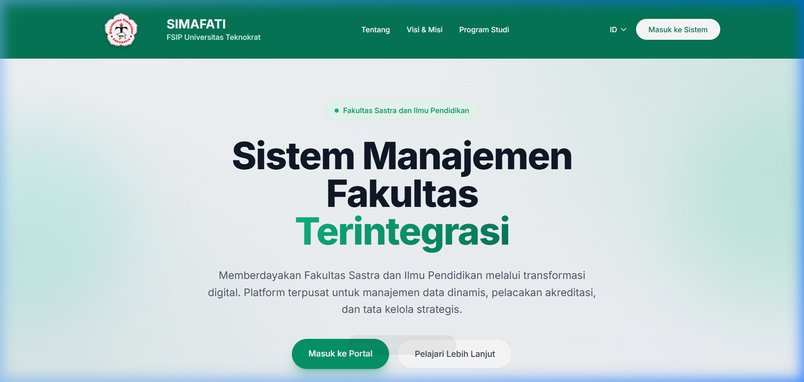
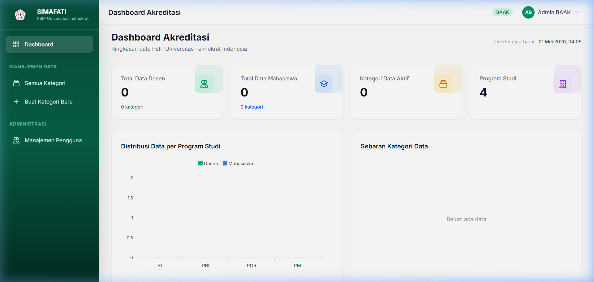
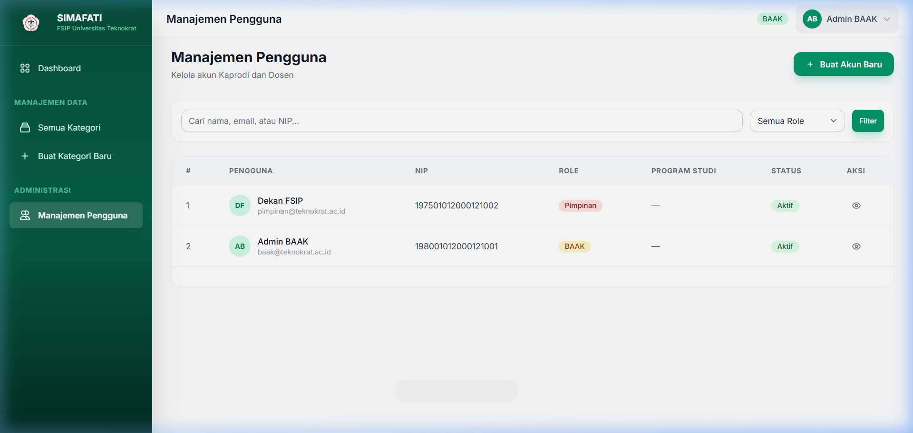

<p align="center">
  
</p>

<h1 align="center">SIMAFATI</h1>
<h3 align="center">Sistem Manajemen Fakultas Terintegrasi</h3>
<p align="center">
  Fakultas Sastra dan Ilmu Pendidikan (FSIP) — Universitas Teknokrat Indonesia
</p>

<p align="center">
  
  
  
  
  
</p>

---

## 📖 Tentang

**SIMAFATI** adalah platform manajemen data akreditasi fakultas berbasis web yang dibangun untuk Fakultas Sastra dan Ilmu Pendidikan (FSIP), Universitas Teknokrat Indonesia. Sistem ini memungkinkan pengelolaan data **dosen** dan **mahasiswa** secara dinamis, terintegrasi, dan terpusat dalam satu platform.

> Dibangun dengan arsitektur **Dynamic Entity** — BAAK dapat membuat kategori data baru beserta field-nya secara fleksibel tanpa perlu mengubah kode sumber.

---

## ✨ Fitur Utama

### 🏗️ Dynamic Data Architecture
- **Dynamic Entity Builder** — Buat kategori data baru (tabel) secara dinamis dari UI
- **Custom Fields** — Mendukung tipe field: Text, Textarea, Number, Date, Select, File, Email, Phone, URL
- **Field Configuration** — Setiap field bisa dikonfigurasi: required, filterable, aggregatable, show in table

### 👥 Role-Based Access Control (RBAC)
| Role | Hak Akses |
|------|-----------|
| **BAAK** | Full access — Kelola kategori, data, pengguna |
| **Kaprodi** | CRUD data, hapus kategori |
| **Dosen** | CRUD data, hapus kategori |
| **Pimpinan** | Read-only — Lihat seluruh data tanpa bisa mengubah |

### 📊 Dashboard & Analytics
- Statistik real-time (Total Dosen, Mahasiswa, Kategori, Prodi)
- Chart distribusi data per Program Studi
- Donut chart sebaran kategori data
- Dynamic charts dari aggregatable fields
- Portal khusus Pimpinan (Lihat Data Dosen / Lihat Data Mahasiswa)
- Aktivitas terbaru (recent activity log)

### 🌍 Bilingual (ID/EN)
- Dukungan multi-bahasa penuh di Landing Page
- Language Switcher (dropdown) di Navbar
- Session persistence — pilihan bahasa diingat otomatis

### 🔐 User Management
- BAAK bisa membuat & mengelola akun Kaprodi/Dosen
- Detail profil pengguna (Nama, Email, NIP, Role, Prodi)
- Reset email & password untuk akun yang sudah dibuat
- Toggle aktif/nonaktif akun

### 🎨 Modern UI/UX
- Landing page responsif dengan animasi glassmorphism
- Dashboard premium dengan micro-animations
- Sidebar navigasi dinamis berdasarkan data yang tersedia
- Favicon & branding Universitas Teknokrat Indonesia

---

## 📸 Screenshots

<p align="center">
  
  <br><em>Landing Page — Bilingual (ID/EN)</em>
</p>

<p align="center">
  
  <br><em>Dashboard Akreditasi — BAAK View</em>
</p>

<p align="center">
  
  <br><em>Manajemen Pengguna</em>
</p>

---

## 🏛️ Program Studi

FSIP Universitas Teknokrat Indonesia memiliki 4 Program Studi:

| No | Program Studi | Kode |
|----|---------------|------|
| 1 | S1 Sastra Inggris | SI |
| 2 | S1 Pendidikan Bahasa Inggris | PBI |
| 3 | S1 Pendidikan Olahraga | POR |
| 4 | S1 Pendidikan Matematika | PM |

---

## 🛠️ Tech Stack

| Layer | Technology |
|-------|-----------|
| **Backend** | Laravel 11, PHP 8.2+ |
| **Frontend** | Blade Templates, TailwindCSS 3 |
| **Build Tool** | Vite 6 |
| **Database** | MySQL 8 |
| **Auth & RBAC** | Spatie Laravel Permission |
| **Charts** | ApexCharts |
| **Icons** | Heroicons (SVG) |
| **Font** | Inter (Google Fonts) |

---

## ⚡ Instalasi & Setup

### Prasyarat

- PHP >= 8.2
- Composer
- Node.js >= 18 & NPM
- MySQL 8

### Langkah Instalasi

```bash
# 1. Clone repository
git clone https://github.com/HafisYulianto/SIMAFATI-FSIP-UTI.git
cd SIMAFATI-FSIP-UTI

# 2. Install dependencies
composer install
npm install

# 3. Setup environment
cp .env.example .env
php artisan key:generate

# 4. Konfigurasi database di .env
# DB_DATABASE=simafati
# DB_USERNAME=root
# DB_PASSWORD=

# 5. Jalankan migrasi & seeder
php artisan migrate --seed

# 6. Buat symbolic link untuk storage
php artisan storage:link

# 7. Jalankan aplikasi
php artisan serve
npm run dev
```

Akses aplikasi di: **http://127.0.0.1:8000**

---

## 🔑 Default Accounts

| Role | Email | Password |
|------|-------|----------|
| **BAAK** | `baak@teknokrat.ac.id` | `password` |
| **Pimpinan** | `pimpinan@teknokrat.ac.id` | `password` |
| **Kaprodi** | `kaprodi.pbi@teknokrat.ac.id` | `password` |
| **Dosen** | `dosen@teknokrat.ac.id` | `password` |

> ⚠️ **Penting:** Segera ganti password default setelah deployment ke production!

---

## 📁 Struktur Proyek

```
SIMAFATI-FSIP-UTI/
├── app/
│   ├── Http/Controllers/
│   │   ├── Auth/LoginController.php        # Authentication
│   │   ├── DashboardController.php         # Dashboard & Pimpinan Browse
│   │   ├── DynamicEntityController.php     # Kategori data CRUD
│   │   ├── DynamicRecordController.php     # Record data CRUD
│   │   └── UserManagementController.php    # Manajemen pengguna
│   ├── Models/
│   │   ├── DynamicEntity.php               # Model kategori dinamis
│   │   ├── DynamicField.php                # Model field/kolom
│   │   ├── DynamicRecord.php               # Model record data
│   │   ├── ProgramStudi.php                # Model program studi
│   │   └── User.php                        # Model pengguna
│   ├── Middleware/
│   │   └── LocalizationMiddleware.php      # Middleware bahasa (i18n)
│   └── Services/
│       └── DashboardAggregationService.php # Service chart & aggregasi
├── resources/views/
│   ├── landing.blade.php                   # Landing page (bilingual)
│   ├── auth/login.blade.php                # Halaman login
│   ├── dashboard/
│   │   ├── index.blade.php                 # Dashboard utama
│   │   └── pimpinan-browse.blade.php       # Browse data (Pimpinan)
│   ├── entities/                           # CRUD kategori data
│   ├── records/                            # CRUD record data
│   ├── users/                              # Manajemen pengguna
│   └── components/                         # Blade components
├── lang/
│   ├── en/landing.php                      # Terjemahan EN
│   └── id/landing.php                      # Terjemahan ID
├── routes/web.php                          # Route definitions
└── database/
    ├── migrations/                         # Schema database
    └── seeders/                            # Data awal
```

---

## 🔄 Arsitektur Dynamic Entity

```
┌──────────────────┐     ┌──────────────────┐     ┌──────────────────┐
│  DynamicEntity   │────▶│  DynamicField    │     │  DynamicRecord   │
│                  │     │                  │     │                  │
│  - name          │     │  - name          │     │  - data (JSON)   │
│  - root_category │     │  - type          │     │  - created_by    │
│  - description   │     │  - is_required   │     │  - program_studi │
│  - created_by    │     │  - is_filterable  │     │                  │
└──────────────────┘     │  - is_aggregatable│     └──────────────────┘
         │               └──────────────────┘              │
         │                                                  │
         └──────────────── hasMany ──────────────────────────┘
```

Setiap **Entity** (kategori) memiliki custom **Fields** (kolom). Data disimpan sebagai **Records** dengan format JSON fleksibel.

---

## 👨‍💻 Dibuat Oleh

**Hafis Yulianto & M. Dava Ardana** — Mahasiswa Magang  
Fakultas Sastra dan Ilmu Pendidikan  
Universitas Teknokrat Indonesia

---

<p align="center">
  <sub>© 2026 FSIP Universitas Teknokrat Indonesia. All rights reserved.</sub>
</p>